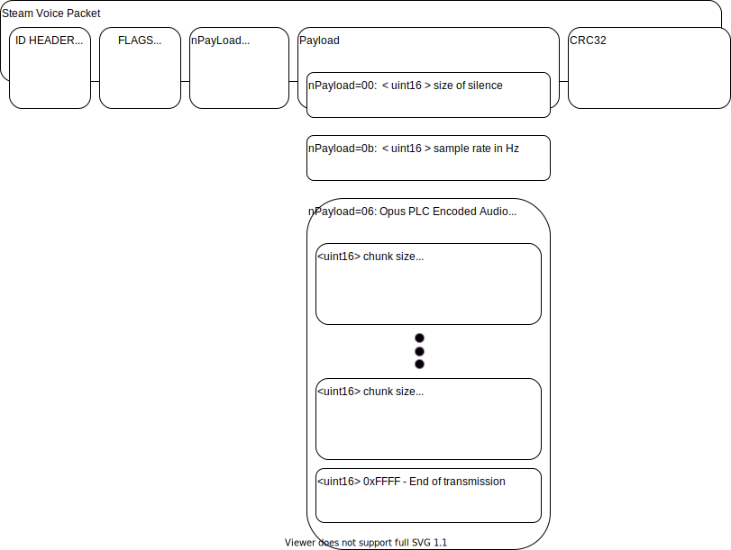

# Project Contents
This project is comprised of multiple projects

1. SteamVocalsCpp ; this project uses Steam SDK to grab audio from the mic and print the encoded packets.  
   I used this to work out if the packets differed from those found in the Facepunch Rust game  
   
2. RustServer\rustserver\oxide\plugins\VoiceStreaming.cs ; this project generates an NPC, and either plays a fixed "test" utterance, or streams from the web server  
     Commands are:  
		/stream identify - identifies an object you are looking at  
		/stream npc 	 - creates npc, and streams the "test" utterance  
		/stream web 	 - once you make the NPC, this command will stream from the web server the WAV file  

3. VoiceStreamServer ; This project UUEncodes and transmits a binary packet of audio, you could just use your own webserver for this with various plugins

4. RustServer ; sample project with the plugin from #2 above, download steamcmd.exe and double click GO.bat

5. Rust - Localhost ; uses steam to automatically connect to the server above in #4


# Dependencies

The above projects are dependent on Opus 1.3.1, and Steam SDK 2020 place them in the folders opus-1.3.1, and sdk respevtively.
1. Download the FFMPEG tool from https://www.gyan.dev/ffmpeg/builds/ffmpeg-release-full.7z and unzip to this folder
2. Download the steam SDK from https://partner.steamgames.com/doc/sdk and unzip to this folder
3. Download steamcmd.exe client from https://developer.valvesoftware.com/wiki/SteamCMD#Windows and upzip to this folder
4. Download the Opus CODEC from https://opus-codec.org/release/stable/2019/04/12/libopus-1_3_1.html and unzip to this folder
5. Open the win32\VS2015\opus.sln, and build the x64 libraries for Debug


# Steam Audio Packet Format

Packet Format for Audio streaming from a Steam SDK API is as follows:

```
 0000 uint32 : 57 5c 35 00  : HEADER ID
 0004 uint32 : 01 00 10 01  : FLAGS?
 
 0008 uint8  : 00 / 06 / 0b : nPayload Type
 0009 data   : ...
 ...
 ...
 000N uint32 : ...          : CRC32 as per Wikis definition
 
Payload Types are as below, there are others but you wont see them as of 2020 Steam Client/API.

 nPayLoadType=0x00
	uint8    : 0x00             : Payload is Silence of N samples, usually follows an utterance
	uint16   : 0x0000 .. 0xffff : 0 .. 65535 samples of silence
		
 nPayLoadType=0x06
    uint8    : 0x06             : Payload is an OPUS PLC compressed audio chunk
	 uint16   :                  : Chunk Size, not including these two bytes and the uint16 Framesize.
	  uint16   :                  : Frame Size for a single OPUS Frame (N x 160 sammples), 0xFFFF for end of transmission
	  uint16   :                  : Sequence number, increments in counts of 1
	  data     :                  : <Frame Size> amount of data
	  ... 
	  <next frame>
	  <next frame>
	  
 nPayLoadType=0x0b
	uint16   :                  : Sample Rate in HZ, usually 240000Hz as of 2020.

```


# Steam Audio Packet Format (Visualization)



# Example Steam Audio Packet Format
```
	// HEADER
	0x57, 0x5c, 0x35, 0x00, 0x01, 0x00, 0x10, 0x01, 

	// SAMPLE RATE
	0x0b, 0xc0, 0x5d, 
	
	// OPUS CHUNK
	0x06, 0x15, 0x01, 

	0x5e, 0x00,
	0x08, 0x00, 
	0x68, 0xac, ...
	...
	0x7d, 0x00, 0x9e, 0xd5, 0x4b, 0x8e, 
	
	0x57, 0x00, 
	0x09, 0x00, 
	0x68, 0xaa, ...
	...
	0x5b, 0x5a, 0x36, 0x5a, 0xd6, 0x4f, 0x0b, 
	
	0x54, 0x00, 
	0x0a, 0x00, 
	0x68, 0x8f, ...
	...
	0xe9, 0xe2, 0x94, 0x38, 


	// OPUS CHUNK
	0x0b, 0xc0, 0x5d, 
	
	0x06, 0x1c, 0x01, 
	0x5b, 0x00, 
	0x0b, 0x00, 
	
	0x68, 0x8d, ...
	...
	0x8c,
	
	// CRC
	0x5b, 0x76, 0x48

```
